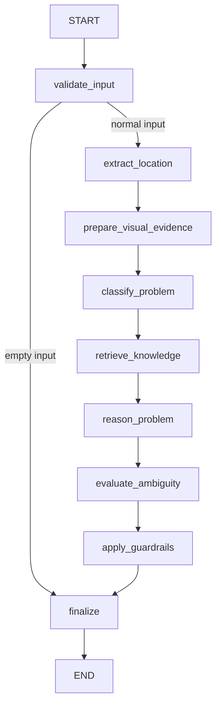

# Component 1 Python Problem Understanding Service

## Purpose and architecture

This is the only active Component 1 problem-understanding runtime. FastAPI invokes a request-scoped LangGraph workflow and returns structured analysis. The logical agent name remains `ProblemUnderstandingAgent` in ASP.NET orchestration.

```text
Flutter -> ASP.NET Core -> ProblemUnderstandingWorkflowService
 -> AgentOrchestrator -> AgentRegistry
 -> ExternalProblemUnderstandingAgentAdapter
 -> ProblemUnderstandingHttpClient -> Python FastAPI -> LangGraph
```

ASP.NET owns authentication, authorization, service-request lifecycle, deterministic domain validation, persistence, monitoring, and failure recovery. Python owns grounded reasoning, deterministic Python tools, provider selection, ambiguity evaluation, and output guardrails. Python has no direct database ownership. React and Flutter only call the public ASP.NET API.

See [shared architecture](../README.md), [C1 domain and public API](../../docs/components/component-1-problem-understanding/README.md), and [historical evidence](../../docs/agents/c1-architecture-evidence.md).

## LangGraph workflow



[problem_graph.py](app/graphs/problem_graph.py) defines this order; [state.py](app/graphs/state.py) defines transient state. Validation can finalize an empty-input result directly. HTTP schema validation rejects an empty string before graph invocation; whitespace and direct graph calls still require the graph guard. The ASP.NET adapter also handles whitespace input without a remote call.

Grounding runs before model reasoning. Ambiguity evaluation includes answered clarification history. A non-degraded `Unclassified` model result can be aligned to a canonical deterministic category; degraded results are not promoted.

## Input contract

The [request schema](app/schemas/request.py) and [.NET wire DTOs](../../backend/src/AssistLK.Agents/DTOs/AgentExecutionWireDtos.cs) define the internal JSON contract.

| Field | Meaning |
|---|---|
| `requestId` | UUID correlation identifier |
| `agentName` | Defaults to `ProblemUnderstandingAgent` |
| `operation` | Defaults to `analyze-problem` |
| `timestamp` | Optional dispatch timestamp |
| `parameters` | Optional object, defaults to empty |
| `input.serviceRequestId` | Service request UUID |
| `input.description` | Customer description, 1–2000 characters |
| `input.categoryHint` | Optional customer preference, not authoritative classification |
| `input.locationText` | Optional supplied location text |
| `input.latitude`, `input.longitude` | Optional coordinates with geographic bounds |
| `input.clarificationHistory` | Ordered answered items containing `round`, `question`, `answer` |
| `input.visualEvidence` | Optional array (defaults to empty), at most three normalized JPEG transport items |

ASP.NET supplies answered history ordered by round and sequence. The Python round field has a lower bound of one; the two-round business limit is enforced by ASP.NET, not by a Python schema upper bound. Customer content is data, not permission to override system instructions.

### Phase 3 visual transport (no live vision)

`input.visualEvidence` contains provider-neutral [VisualEvidence](app/schemas/visual_evidence.py) items with `attachmentId` (unique nonempty UUID), `contentType` (`image/jpeg` only), `dataBase64` (canonical Base64), `width` and `height` (strict integers 1–2048). Maximum three items, 2 MiB decoded per item and 4 MiB decoded total; the encoded ceilings are 2,796,204 characters per item and 5,592,412 total including padding. Validation bounds encoded length before decoding and checks decoded size independently. Decoded validation bytes are discarded; no Pillow/OpenCV dependency or second normalization pipeline is introduced.

ASP.NET owns authorization, secure image normalization and private storage. It constructs this payload only after persisting a small workflow input containing text, evidence revision and attachment IDs. Base64, binary contents, filenames and storage paths never enter persisted agent audit or memory. See [backend contract and limits](../../backend/ATTACHMENTS.md#phase-3-internal-visual-evidence-contract).

The graph holds one request-scoped evidence collection. `prepare_visual_evidence` only reports internal `not_requested`, `available`, `unsupported` or `failed` status. `available` means structurally valid evidence and a declared capability, not interpreted images. All current provider implementations inherit `supports_images = false`; Gemini/OpenAI payloads remain text-only, and Offline never invents visual findings. Preparation does not alter category, urgency, prompts, tool counts or response fields. Invalid HTTP input returns generic 422 without echoing Base64. Empty input still follows direct finalization.

There is no persisted/checkpointed graph state, live vision, new response observation field or public client change in Phase 3. Phase 4 must implement and test provider-specific image conversion/reasoning before enabling image capability. Do not log or enable tracing that exports transient image-bearing state.

## Output contract

The [response schema](app/schemas/response.py) returns one envelope:

| Field | Meaning |
|---|---|
| `requestId` | Echoed correlation identifier |
| `success` | Whether execution produced a usable result |
| `result` | Structured analysis, or null on execution failure |
| `errorMessage` | Failure description, or null |
| `metadata` | Execution audit summary |

`result` contains `category`, `problemSummary`, `urgency`, `needsMoreInformation`, `followUpQuestions`, `confidence`, `extractedLocation`, and `additionalInformation`. Confidence and clarification fields are inside `result`, not duplicated at envelope level. ASP.NET maps `problemSummary` to its persisted detected-problem field.

Canonical categories are Plumbing, Electrical, Vehicle Repair, Appliance Repair, and Unclassified. Urgency is Unknown, Low, Medium, High, or Critical. Confidence is normalized to 0–1. Follow-up questions are bounded to three.

Metadata contains `agentName`, `provider`, `degraded`, `durationMs`, and `toolExecutions`; each tool audit contains `tool`, `success`, and `durationMs`. This internal provider metadata is not customer-facing branding: clients use **AssistLK AI**.

## Deterministic tools and location

| Python module | Responsibility |
|---|---|
| [location_extraction.py](app/tools/location_extraction.py) | Trim supplied text, validate paired coordinates, never invent coordinates |
| [problem_classification.py](app/tools/problem_classification.py) | Deterministic category grounding from problem text |
| [service_knowledge.py](app/tools/service_knowledge.py) | Category-related service knowledge and safe terminology |

These Python functions do not implement the C# `IAgentTool` interface. Shared .NET tool abstractions remain separate from this graph.

Smart Location reverse geocoding is separate infrastructure:

```text
Flutter GPS -> ASP.NET /api/location/reverse-geocode -> OpenStreetMap Nominatim
```

Nominatim is not a LangGraph node or agent tool. Python processes location context already supplied to it.

## Providers and guardrails

[ProviderFactory](app/providers/factory.py) selects `gemini`, `openai`, or `offline` through [BaseLLMProvider](app/providers/base.py). Provider-specific HTTP behavior stays inside provider implementations. Missing selected-provider keys use offline simulation only when allowed; explicit `offline` selection does not need a model key. This is not automatic failover between live providers.

[Guardrails](app/safety/guardrails.py) normalize categories and urgency, bound confidence, filter listed dangerous advice, and add uncertainty language. Unclassified output requires more information, Unknown urgency, and confidence at most 0.4. Follow-up questions are filtered and bounded. These deterministic checks are not a guarantee of comprehensive sanitization or diagnostic correctness. ASP.NET validates outputs again before domain changes.

## Clarification behavior

```text
Initial analysis -> Round 1 -> answers -> re-analysis
 -> Round 2 if needed -> answers -> final re-analysis
```

ASP.NET permits at most two persisted clarification rounds. Answered Round 2 must still be analyzed. No Round 3 is created. If information remains insufficient, the customer is directed to improve the main description. Python returns questions and uses answered history; it does not persist rounds, accept customer answers directly, or change lifecycle state.

## Failure and degraded behavior

- **Successful degraded output:** A reasoning failure caught inside the graph produces an uncertainty-aware Unclassified result, Unknown urgency, low confidence, clarification questions, and `metadata.degraded=true`. The envelope can still have `success=true`; ASP.NET applies the structured result under domain rules.
- **Transport/service failure:** Unreachable service, timeout, invalid response, or unsuccessful execution causes adapter failure. ASP.NET workflow recovery restores the valid pre-analysis state when analysis has begun, and records failure evidence. There is no native C# agent fallback.
- **Configuration failure:** Provider creation happens before the graph exception handler. For example, a missing required key with offline simulation disabled can fail the request rather than produce a degraded graph result.

Python owns bounded provider retries. The .NET HTTP client does not implement an automatic retry loop. Recovery is implemented by [ProblemUnderstandingWorkflowService](../../backend/src/AssistLK.Application/Services/ProblemUnderstandingWorkflowService.cs).

## Configuration

[config.py](app/config.py) is authoritative; copy [.env.example](.env.example) for local values. Model secrets belong to the Python process environment or its local gitignored `.env`, not backend/root model-key configuration.

| Variable | Code default |
|---|---|
| `SERVICE_NAME` | `problem-understanding-agent` |
| `HOST` | `127.0.0.1` |
| `PORT` | `8001` |
| `ENVIRONMENT` | `development` |
| `LLM_PROVIDER` | `gemini` |
| `GOOGLE_API_KEY` | Unset |
| `GEMINI_MODEL` | `gemini-3.6-flash` |
| `OPENAI_API_KEY` | Unset |
| `OPENAI_MODEL` | `gpt-4o-mini` |
| `LLM_TIMEOUT_SECONDS` | `15.0` per attempt; allowed 1–60 |
| `LLM_MAX_ATTEMPTS` | `2` total attempts; allowed 1–3 |
| `ALLOW_OFFLINE_SIMULATION` | `true` |
| `INTERNAL_API_KEY` | Unset |

Settings load `.env` relative to the working directory and are cached. Restart after configuration changes. Explicit Uvicorn/launcher host and port arguments control listening; changing `HOST` or `PORT` alone does not override those arguments. The Dockerfile explicitly binds port 8001.

Model defaults are repository configuration, not a guarantee of remote provider/model availability. Prior Gemini live verification is recorded in [evidence](../../docs/agents/c1-architecture-evidence.md). OpenAI API reachability with invalid credentials is not successful live inference.

## Local setup and running

Python 3.11+ is declared in [pyproject.toml](pyproject.toml). Install the repository's pinned [requirements](requirements.txt), including test dependencies. From the repository root, in PowerShell:

```powershell
cd agent-services/problem-understanding-agent
python -m venv .venv
.\.venv\Scripts\Activate.ps1
python -m pip install -r requirements.txt
Copy-Item .env.example .env
```

Copy the example only on first setup; preserve an existing local `.env`. Configure the selected provider locally. For deterministic development use `LLM_PROVIDER=offline`.

From the service directory with the venv active:

```powershell
python -m uvicorn app.main:app --host 127.0.0.1 --port 8001
```

Alternatively, from the repository root after setup:

```powershell
.\scripts\start-c1-dev.ps1
```

The [launcher](../../scripts/start-c1-dev.ps1) uses the service venv and working directory, verifies service identity via health, and sets the backend service URL. It reuses a recognized existing service, rejects an unknown port occupant, and cleans up processes it started on normal shutdown. It leaves a pre-existing Python service running. See [stop helper](../../scripts/stop-c1-dev.ps1) for interrupted-session cleanup.

## Health, endpoints, and authentication

| Route | Behavior |
|---|---|
| `GET /health` | Reports status, service, environment, selected provider and model; no execution-auth dependency |
| `POST /agent/execute` | Executes the request envelope |
| `POST /internal/v1/problem-understanding/analyze` | Alias using the same schema and authentication |

Health creates the provider but does not perform inference. Offline health is not proof of live Gemini/OpenAI execution. Invalid required provider configuration can also make health fail.

When `INTERNAL_API_KEY` is nonblank, execution routes require a matching key. ASP.NET sends `X-Internal-Api-Key`; Python also accepts `X-Api-Key`, with the internal header taking precedence when supplied. Unconfigured execution authentication is open, including outside development: environment naming does not enforce the key. Keep the service internal and configure the shared key for deployment. `/health` remains unprotected by this dependency.

## ASP.NET integration

[AgentServicesOptions](../../backend/src/AssistLK.Agents/Configuration/AgentServicesOptions.cs) binds:

```env
AgentServices__ProblemUnderstandingUrl=http://127.0.0.1:8001
AgentServices__InternalApiKey=
AgentServices__TimeoutSeconds=45
```

Match the backend shared key to Python `INTERNAL_API_KEY` when enabling authentication. The base URL must be absolute HTTP/HTTPS and the timeout positive. Coordinate the .NET total timeout with Python per-attempt timeout and retry settings.

[ExternalProblemUnderstandingAgentAdapter](../../backend/src/AssistLK.Agents/Adapters/ExternalProblemUnderstandingAgentAdapter.cs) implements `IAgent` under the logical name `ProblemUnderstandingAgent`; [ProblemUnderstandingHttpClient](../../backend/src/AssistLK.Agents/Clients/ProblemUnderstandingHttpClient.cs) calls `/agent/execute`. Provider credentials and customer JWTs are not part of the execution payload.

## Tests

From the service directory, with the venv active:

```powershell
python -m pytest
```

[Tests](tests/) cover schemas, tools, graph behavior, guardrails, providers, and FastAPI. They use controlled/offline dependencies, not successful live inference as a prerequisite. See the [cross-stack testing guide](../../docs/development/testing-guide.md) for .NET, Flutter, React, and the explicitly opt-in live smoke path. Normal .NET tests do not require Python running.

## Security and known limitations

- No model API keys belong in Flutter or React. Keep provider secrets local/server-side in Python, and never commit `.env` values.
- ASP.NET remains the authorization and persistence boundary. Python does not own PostgreSQL connections or domain mutations.
- Hidden reasoning is not persisted or returned to clients. Persisted/output analysis is structured result data with bounded audit metadata; transient graph state is not a database memory system.
- Customer description, category preference, and clarification answers are untrusted data. Do not expose internal prompts or intermediate state.
- Guardrails are deterministic checks, not exhaustive safety guarantees. Diagnostic exception paths can contain details; do not promise comprehensive log/error sanitization.
- Neither health nor mocked tests proves live inference. Successful live OpenAI inference has not been established by the available verification history.
- Category grounding and ambiguity checks are heuristic; confidence is not a calibrated probability or a guaranteed diagnosis.
