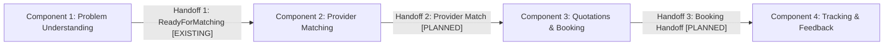

# AssistLK Component Integration Contracts

**Status:** Authoritative API & Handoff Contract Specification  
**Applies To:** Cross-Component Integration between Components 1, 2, 3, and 4  
**Related Documents:** [Component Boundaries](../architecture/component-boundaries.md), [Database Ownership](../development/database-ownership.md)

---

## 1. Architectural Rules for Cross-Component Integration

1. **Explicit Handoff Boundaries:** No component may query or mutate another component's private database tables or entity models directly.
2. **Strict Distinctions:** This document explicitly categorizes contracts as:
   - **[EXISTING]:** Currently implemented, tested, and active in ASP.NET Core API (`AssistLK.Api`).
   - **[PLANNED / FUTURE CONTRACT]:** Agreed contract schemas for Components 2, 3, and 4 to implement during their respective sprints.
3. **Data Immutability at Handoff:** Once a handoff payload is dispatched, the receiving component treats the input data as an immutable snapshot.

---

## 2. Major Component Handoffs



---

## 3. Handoff 1: Component 1 → Component 2 (Ready For Matching)

### Status: [EXISTING]

When customer problem understanding is complete and confirmed, the request transitions to `ReadyForMatching`. Component 2 consumes this contract to find, score, and rank suitable service providers.

- **Owning Component:** Component 1 (Service Request & Problem Understanding)
- **Receiving Component:** Component 2 (Provider Management & Intelligent Matching)
- **Trigger / Precondition:** `ServiceRequest.Status == ServiceRequestStatus.ReadyForMatching`
- **Ownership Rule:** Component 2 has **read-only** access to this contract. Component 2 cannot alter the service request category, description, or urgency.

### Existing Endpoints & C# Contracts

#### HTTP API Endpoint [EXISTING]
- **Method / Route:** `GET /api/service-requests/{id}`
- **Authentication:** `Bearer JWT (Roles: Customer, Admin, Provider)`
- **Response Type:** `ServiceRequestResponse`

#### Application Service Method [EXISTING]
- **Interface:** `IServiceRequestService.GetReadyForMatchingAsync(Guid serviceRequestId, CancellationToken cancellationToken)`
- **Return Type:** `Task<ServiceRequestForMatchingResponse?>`

#### DTO Definition [EXISTING] (`AssistLK.Application.ServiceRequests.DTOs.ServiceRequestForMatchingResponse`):
```csharp
public sealed record ServiceRequestForMatchingResponse
{
    public required Guid ServiceRequestId { get; init; }
    public required string Category { get; init; }
    public required string ProblemSummary { get; init; }
    public required decimal Confidence { get; init; }
    public required ServiceRequestUrgency Urgency { get; init; }
    public required string LocationText { get; init; }
    public double? Latitude { get; init; }
    public double? Longitude { get; init; }
    public required ServiceRequestStatus Status { get; init; }
    public required DateTime CreatedAt { get; init; }
    public required DateTime UpdatedAt { get; init; }
}
```

#### JSON Payload Sample:
```json
{
  "serviceRequestId": "7b8f9e61-a083-4903-8d6b-31da8fe23315",
  "category": "Plumbing",
  "problemSummary": "Water leaking from main kitchen pipe under sink.",
  "confidence": 0.95,
  "urgency": "High",
  "locationText": "No 45, Galle Road, Colombo 03",
  "latitude": 6.9015,
  "longitude": 79.8529,
  "status": "ReadyForMatching",
  "createdAt": "2026-09-09T10:00:00Z",
  "updatedAt": "2026-09-09T10:05:00Z"
}
```

---

## 4. Handoff 2: Component 2 → Component 3 (Provider Matched)

### Status: [PLANNED / FUTURE CONTRACT]

Once Component 2 scores available providers and candidate providers are identified (or selected), Component 2 hands off the match result to Component 3 for quotation generation and booking confirmation.

- **Owning Component:** Component 2 (Provider Management & Intelligent Matching)
- **Receiving Component:** Component 3 (Quotation, Booking & Service Coordination)
- **Trigger / Precondition:** Matching algorithm or `ProviderMatchingAgent` selects one or more qualified providers.
- **Ownership Rule:** Component 3 receives candidate provider IDs and scores; Component 3 owns quotation issuance and schedule slot reservation.

### Planned Contracts & DTOs

#### Planned Service Contract:
```csharp
public sealed record ProviderMatchedNotification
{
    public required Guid ServiceRequestId { get; init; }
    public required Guid ProviderId { get; init; }
    public required decimal MatchingScore { get; init; }
    public required string MatchingRationale { get; init; }
    public required decimal DistanceKm { get; init; }
    public required DateTime MatchedAt { get; init; }
}
```

#### Planned API Endpoint:
- **Method / Route:** `POST /api/quotations/initiate`
- **Request Body:**
```json
{
  "serviceRequestId": "7b8f9e61-a083-4903-8d6b-31da8fe23315",
  "providerId": "9e2c4b81-6453-4dc9-9803-fb6517ba9182",
  "matchingScore": 0.94,
  "matchingRationale": "Top-rated plumber within 3.2km with emergency availability."
}
```

---

## 5. Handoff 3: Component 3 → Component 4 (Booking Confirmed)

### Status: [PLANNED / FUTURE CONTRACT]

When the customer accepts a quotation and the appointment slot is confirmed, Component 3 hands off the confirmed booking to Component 4 for live dispatch tracking, transit milestones, job completion verification, and feedback.

- **Owning Component:** Component 3 (Quotation, Booking & Service Coordination)
- **Receiving Component:** Component 4 (Service Tracking, Completion & Feedback)
- **Trigger / Precondition:** `Booking.Status == BookingStatus.Confirmed` (or `Quotation.Status == QuotationStatus.Accepted`).
- **Ownership Rule:** Component 4 tracks the active execution and completion proof; Component 4 cannot modify quotation pricing or renegotiate terms.

### Planned Contracts & DTOs

#### Planned Service Contract:
```csharp
public sealed record ConfirmedBookingHandoff
{
    public required Guid BookingId { get; init; }
    public required Guid ServiceRequestId { get; init; }
    public required Guid CustomerId { get; init; }
    public required Guid ProviderId { get; init; }
    public required decimal AgreedCost { get; init; }
    public required DateTime ScheduledTimeUtc { get; init; }
    public required string ServiceLocationText { get; init; }
    public double? Latitude { get; init; }
    public double? Longitude { get; init; }
}
```

#### Planned API Endpoint:
- **Method / Route:** `POST /api/tracking/start`
- **Request Body:**
```json
{
  "bookingId": "34c56789-abcd-4ef0-9123-456789abcdef",
  "serviceRequestId": "7b8f9e61-a083-4903-8d6b-31da8fe23315",
  "customerId": "81234567-1234-1234-1234-123456789abc",
  "providerId": "9e2c4b81-6453-4dc9-9803-fb6517ba9182",
  "agreedCost": 4500.00,
  "scheduledTimeUtc": "2026-09-10T09:00:00Z",
  "serviceLocationText": "No 45, Galle Road, Colombo 03",
  "latitude": 6.9015,
  "longitude": 79.8529
}
```

---

## 6. Summary Matrix of Contracts

| Handoff Boundary | From | To | Contract Name | Status |
|---|---|---|---|---|
| **C1 → C2** | Problem Understanding | Provider Matching | `ServiceRequestForMatchingResponse` | **EXISTING** |
| **C2 → C3** | Provider Matching | Quotations & Booking | `ProviderMatchedNotification` | **PLANNED** |
| **C3 → C4** | Quotations & Booking | Tracking & Feedback | `ConfirmedBookingHandoff` | **PLANNED** |
| **C4 → Terminal** | Tracking & Feedback | System Closure | `ServiceCompletionSummary` | **PLANNED** |
