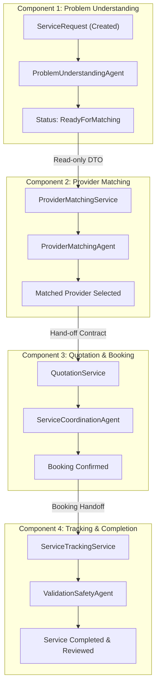

# AssistLK Component Boundaries & Ownership Architecture

**Status:** Authoritative Architectural Standard  
**Applies To:** Component 1, Component 2, Component 3, Component 4  
**Related Documents:** [System Architecture](system-architecture.md), [Component Development Rules](../development/component-development-rules.md), [Database Ownership](../development/database-ownership.md), [Component Integration Contracts](../api/component-contracts.md)

---

## 1. Executive Summary & Architectural Invariant

AssistLK is structured around four business and architectural components. Each component is owned by a specific engineering team member across all system tiers:
```text
Database Entities → Backend Services → Agent Reasoning → React Frontend → Flutter Mobile → Automated Tests
```

### The Cardinal Architecture Rules
1. **Contract-Mediated Communication:** No component may directly query, mutate, or access another component's EF Core `DbContext`, repositories, or private entities. All cross-component interactions must occur via public Application service contracts or documented HTTP APIs.
2. **Persistence Boundary:** Agents (`AssistLK.Agents` or external Python microservices) **never** access the database directly. Application workflow services own the transaction, state machine, and persistence.
3. **Identity & Auth Boundary:** Authentication and authorization are centralized. Components consume identity through `ClaimsPrincipal` (`User.FindFirstValue(ClaimTypes.NameIdentifier)`) and must verify entity ownership before executing mutations.

---

## 2. Component 1: Smart Service Request & Problem Understanding

### Member 1 Ownership

| Dimension | Responsibility & Scope |
|---|---|
| **Domain Responsibility** | Ingestion of customer service requests, initial problem description, capture of GPS coordinates/human-readable location, problem understanding, categorization, urgency assessment, and clarifying question generation. |
| **Backend Responsibility** | `IServiceRequestService`, `IProblemAnalysisRepository`, `IServiceRequestRepository`, `ProblemUnderstandingWorkflowService`, `ServiceRequestsController`. Manages state transitions: `Created` → `Analyzing` → `Analyzed` / `AwaitingInformation` → `ReadyForMatching` / `Cancelled`. |
| **Agent Responsibility** | Python-only `ProblemUnderstandingAgent` via the ASP.NET external adapter. Produces structured category, summary, urgency, confidence, and clarification output. See [service contract](../../agent-services/problem-understanding-agent/README.md). |
| **React Responsibility** | Customer & Admin views (`web/src/features/serviceRequests/`). Multi-step request creation, location extraction / manual input, analysis progress card, clarification questions, and status lifecycle badges. |
| **Flutter Responsibility** | Customer request creation screen (`mobile/lib/features/service_requests/`). Native geolocation capture, real-time status display, clarification answer input. |
| **Data It Owns** | `ServiceRequest` entity (`Id`, `CustomerId`, `Description`, `LocationText`, `Latitude`, `Longitude`, `Category`, `Urgency`, `Status`, `CreatedAt`, `UpdatedAt`), `ProblemAnalysis` entity (`Id`, `ServiceRequestId`, `Category`, `DetectedProblem`, `Confidence`, `Urgency`, `NeedsMoreInformation`, `FollowUpQuestions`, `AgentName`, `CreatedAt`). |
| **Data It Consumes** | Authenticated Customer Identity (`User.Id` from JWT). |
| **Allowed Interactions** | Exposes `GetReadyForMatchingAsync(serviceRequestId)` and `GET /api/service-requests/{id}/ready-for-matching` for downstream matching by Component 2. |
| **Handoff Boundary** | When `ServiceRequest.Status` reaches `ReadyForMatching`, Component 1's active pipeline completes. The request is handed off as a read-only snapshot to Component 2. |

---

## 3. Component 2: Provider Management & Intelligent Matching

### Member 2 Ownership

| Dimension | Responsibility & Scope |
|---|---|
| **Domain Responsibility** | Service provider onboarding, profile management, verified skill tags, service radius, real-time availability, and algorithmic / AI matching between `ReadyForMatching` service requests and suitable providers. |
| **Backend Responsibility** | `IProviderService`, `IProviderMatchingService`, `IProviderRepository`, `ProvidersController`. Queries eligible providers within geospatial bounds, filters by category, scores providers by ratings, distance, and workload, and ranks candidates. |
| **Agent Responsibility** | `ProviderMatchingAgent` (.NET or Python microservice). Evaluates problem complexity against provider profiles, analyzes availability trade-offs, and outputs ranked candidates with confidence scores and matching rationales. |
| **React Responsibility** | Admin provider verification portal (`web/src/features/providers/`). Review provider credentials, service categories, approval actions, and platform-wide provider directory. |
| **Flutter Responsibility** | Service provider profile and availability dashboard (`mobile/lib/features/providers/`). Online/offline toggle, operational radius selection, incoming match notifications. |
| **Data It Owns** | `ProviderProfile`, `ProviderSkill`, `ProviderLocation`, `ProviderAvailability`, `MatchingExecution`, `MatchedCandidate`. |
| **Data It Consumes** | Read-only `ServiceRequestForMatchingResponse` (Category, Urgency, Latitude, Longitude, ProblemSummary) provided by Component 1. |
| **Allowed Interactions** | Calls `IServiceRequestService.GetReadyForMatchingAsync(id)`. Once candidate(s) are selected, dispatches match notifications to Component 3 for quotation generation and booking. |
| **Handoff Boundary** | When provider matching concludes with one or more matched candidate providers, Component 2 hands off the matching results (`ServiceRequestId`, `ProviderId`, `MatchingScore`) to Component 3. |

---

## 4. Component 3: Quotation, Booking & Service Coordination

### Member 3 Ownership

| Dimension | Responsibility & Scope |
|---|---|
| **Domain Responsibility** | Quotation issuance, cost breakdown (labour, parts, emergency surcharge), negotiation / clarification, customer quotation acceptance or rejection, appointment scheduling, and booking confirmation. |
| **Backend Responsibility** | `IQuotationService`, `IBookingService`, `IQuotationRepository`, `IBookingRepository`, `QuotationsController`, `BookingsController`. Enforces financial and scheduling state machine (`Draft` → `Issued` → `Accepted`/`Rejected` → `Booked`). |
| **Agent Responsibility** | `ServiceCoordinationAgent` (.NET or Python microservice). Validates cost estimates against historical baseline benchmarks, flags abnormal pricing, facilitates schedule coordination between provider availability and customer preference. |
| **React Responsibility** | Customer & Admin quotation review (`web/src/features/quotations/`). Detailed price breakdown display, approval/rejection dialogs, booking calendar view. |
| **Flutter Responsibility** | Provider quotation creation form and customer booking acceptance screens (`mobile/lib/features/quotations/`). Push alerts for quotation received, one-tap quotation acceptance. |
| **Data It Owns** | `Quotation`, `QuotationItem`, `Booking`, `ScheduleSlot`, `ServiceAgreement`. |
| **Data It Consumes** | `ServiceRequestId` from Component 1; `ProviderId` and match details from Component 2; Customer identity from JWT. |
| **Allowed Interactions** | Consumes matched provider details from Component 2. Updates `ServiceRequest` status via application service contract if quotation accepted. Dispatches confirmed booking to Component 4. |
| **Handoff Boundary** | Once a quotation is accepted and a `Booking` is confirmed with an agreed schedule slot, Component 3 hands off the active booking to Component 4 for execution tracking. |

---

## 5. Component 4: Service Tracking, Completion & Feedback

### Member 4 Ownership

| Dimension | Responsibility & Scope |
|---|---|
| **Domain Responsibility** | Real-time service tracking, provider transit / arrival status, job commencement, scope change verification, completion sign-off, safety validation, dispute handling, and two-way ratings/reviews. |
| **Backend Responsibility** | `IServiceTrackingService`, `IReviewService`, `ITrackingRepository`, `IReviewRepository`, `TrackingController`, `ReviewsController`. Tracks milestone progression: `ProviderDispatched` → `Arrived` → `InProgress` → `Completed` → `Closed`. |
| **Agent Responsibility** | `ValidationSafetyAgent` (.NET or Python microservice). Validates completion criteria, inspects job completion photos/receipts against initial request, verifies safety checklist compliance, and detects anomaly/fraud signals. |
| **React Responsibility** | Admin live tracking console and dispute resolution dashboard (`web/src/features/tracking/`). Operational maps, milestone logs, customer reviews inspection. |
| **Flutter Responsibility** | Real-time map tracking, live status milestones, OTP or digital sign-off at job completion, rating and feedback submission (`mobile/lib/features/tracking/`). |
| **Data It Owns** | `ServiceTrackingLog`, `MilestoneEvent`, `JobCompletionProof`, `ServiceReview`, `DisputeRecord`, `SafetyAuditLog`. |
| **Data It Consumes** | `BookingId` and agreed scope from Component 3; `ServiceRequestId` metadata from Component 1; Provider profile summary from Component 2. |
| **Allowed Interactions** | Reads confirmed booking details from Component 3. On final sign-off, signals Component 1 and Component 3 that the service lifecycle has reached terminal `Completed` state. |
| **Handoff Boundary** | Final terminal state in the AssistLK customer journey. Produces persistent audit records and closes the active workflow. |

---

## 6. Cross-Component Communication Rules



### Prohibited Cross-Component Practices:
- ❌ Direct foreign key navigation across aggregate roots that causes cross-module lockups.
- ❌ Direct SQL joins between Component 1 and Component 3 tables bypassing Application repository boundaries.
- ❌ Controllers in Component 2 directly modifying entities belonging to Component 1.
- ❌ AI agents directly invoking database insert/update operations.
