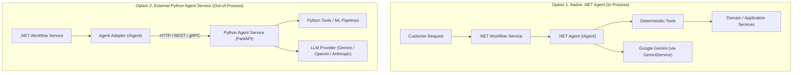
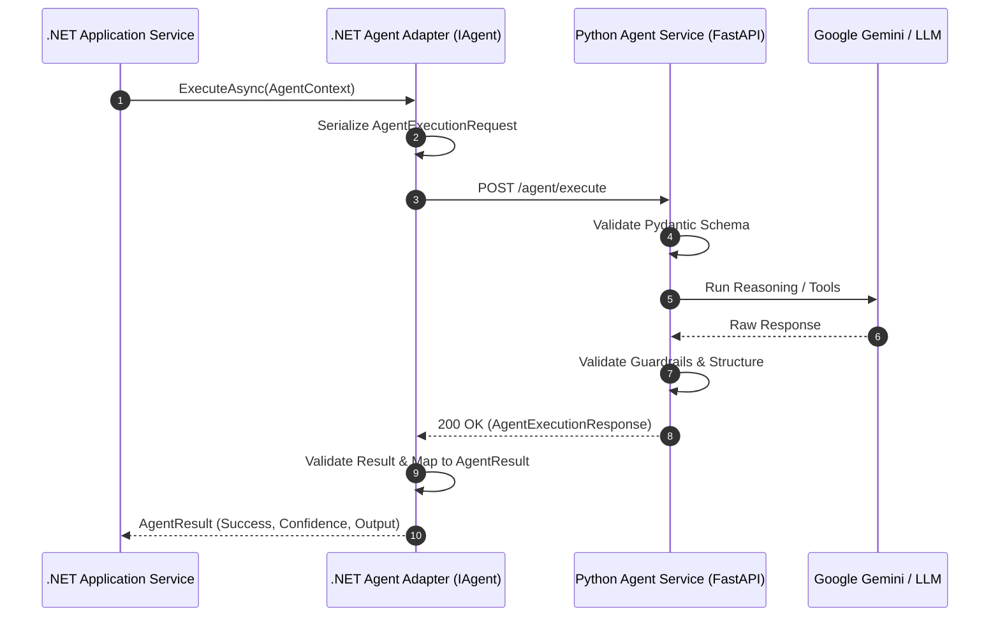
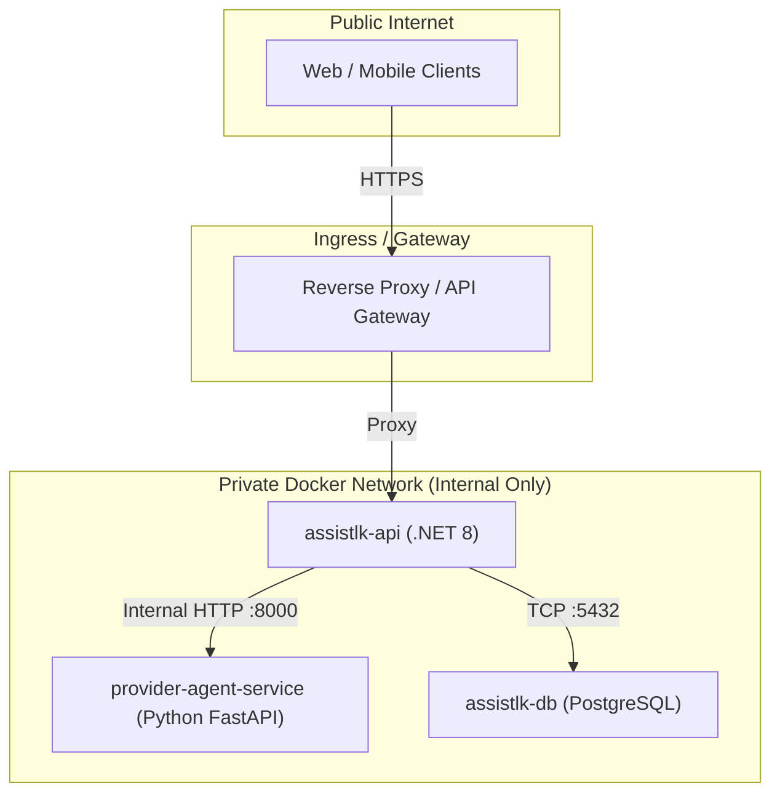

# External Python Agent Service Architecture

**Status:** Approved Architecture Guide  
**Target Audience:** Component Developers, AI Engineers, Backend Engineers  
**Related Documents:** [System Architecture](file:///g:/SE3090_A1/AssistLK/docs/architecture/system-architecture.md), [Agent Foundation](file:///g:/SE3090_A1/AssistLK/docs/architecture/agent-foundation.md), [Component Development Rules](file:///g:/SE3090_A1/AssistLK/docs/development/component-development-rules.md)

---

## 1. Purpose

AssistLK supports a hybrid, flexible agent architecture. Depending on performance requirements, domain coupling, and AI ecosystem needs, components can implement agents using one of two supported approaches:



### Option 1: Native .NET Agent

- **Location:** `backend/src/AssistLK.Agents`
- **Language:** C# (.NET 8)
- **Used when:**
  - Agent requires tight, low-latency integration with .NET application workflows.
  - Agent directly uses existing domain services, EF Core repositories, and in-memory caches.
  - Agent needs shared application services and direct dependency injection.
- **Example:** `ProblemUnderstandingAgent` (Component 1)

```text
Customer Request
       ↓
.NET Workflow
       ↓
.NET Agent (IAgent)
       ↓
Tools (IAgentTool)
       ↓
Domain Services
```

---

### Option 2: External Python Agent Service

- **Location:** `agent-services/<agent-name>/`
- **Language:** Python 3.11+
- **Used when:**
  - The team requires the Python AI ecosystem (e.g., LangChain, LangGraph, LlamaIndex, DSPy).
  - Specialized machine learning or data science libraries are needed (e.g., PyTorch, scikit-learn, spaCy, NetworkX, NumPy, Pandas).
  - Advanced graph-based or multi-agent architectures (e.g., LangGraph state machines) are preferred.
  - Independent lifecycle, isolated scaling, and rapid AI experimentation are necessary without recompiling the .NET solution.

```text
.NET Backend (AssistLK.Application)
        |
        | HTTP / REST / gRPC (Contract-Bound)
        v
Python Agent Service (FastAPI / ASGI)
        |
        | LangChain / LangGraph / Tools
        v
LLM Provider (Google Gemini / OpenAI)
```

---

## 2. Recommended Folder Structure

Python agent services **MUST NOT** be placed inside the `backend/` folder. The `backend/` directory is strictly reserved for the .NET Clean Architecture solution.

All Python agent services reside in an isolated top-level directory: `agent-services/`.

```text
AssistLK/
├── backend/
│   ├── AssistLK.Api/
│   ├── AssistLK.Application/
│   ├── AssistLK.Agents/
│   ├── AssistLK.Domain/
│   └── AssistLK.Infrastructure/
├── agent-services/
│   ├── README.md
│   ├── provider-matching-agent/
│   │   ├── app/
│   │   │   ├── __init__.py
│   │   │   ├── main.py              # FastAPI / ASGI application entrypoint
│   │   │   ├── agent.py             # Core reasoning logic (LangChain/LangGraph)
│   │   │   ├── schemas.py           # Pydantic request/response contract models
│   │   │   ├── config.py            # Environment settings and LLM configuration
│   │   │   ├── tools/               # Deterministic tool implementations
│   │   │   │   ├── __init__.py
│   │   │   │   ├── provider_search.py
│   │   │   │   └── distance_matrix.py
│   │   │   ├── prompts/             # Versioned prompt templates
│   │   │   │   └── matching_prompt.txt
│   │   │   └── safety/              # Output validators and guardrails
│   │   │       ├── __init__.py
│   │   │       └── guardrails.py
│   │   ├── tests/
│   │   │   ├── __init__.py
│   │   │   ├── test_agent.py
│   │   │   ├── test_tools.py
│   │   │   ├── test_contracts.py
│   │   │   └── test_safety.py
│   │   ├── requirements.txt         # Pinned Python dependencies
│   │   ├── pyproject.toml           # Tooling config (ruff, mypy, pytest)
│   │   ├── Dockerfile               # Production container definition
│   │   └── .env.example             # Documented environment variables
│   └── service-coordination-agent/  # Future agent service
└── web/
    └── src/
```

> [!IMPORTANT]
> **Service Isolation Guarantee:**  
> Every Python agent service must be completely standalone. It maintains its own `requirements.txt`, virtual environment, tests, and `Dockerfile`. It must not depend on local relative imports from other agent services or the .NET source tree.

---

## 3. Python Agent Responsibilities

External Python agent services operate as bounded reasoning engines. To preserve Clean Architecture integrity, strict responsibilities are enforced:

### Python Agents CAN:
- **Call LLM APIs:** Connect to Google Gemini, OpenAI, or other approved foundational model APIs using official SDKs.
- **Use LangChain / LangGraph:** Leverage state graphs, reasoning chains, memory windowing, and structured output parsers.
- **Use Python ML Libraries:** Execute clustering, geospatial calculations, semantic similarity, or ranking algorithms.
- **Perform AI Reasoning:** Analyze structured inputs provided by the .NET backend to derive classifications, recommendations, or plans.
- **Execute Internal Tools:** Execute deterministic, sandboxed Python functions (e.g., calculating Haversine distance, parsing criteria, formatting outputs).

### Python Agents MUST NOT:
- **Directly Access PostgreSQL:** External agents are strictly forbidden from maintaining direct database connections (`psycopg2`, `SQLAlchemy`, etc.) to the AssistLK primary database.
- **Modify AssistLK Entities:** Only the .NET `AssistLK.Application` and `AssistLK.Infrastructure` layers have write authority over domain entities and database tables.
- **Bypass the Application Layer:** Python agents cannot be called directly by Web or Mobile frontends. All traffic must flow through .NET controllers and application workflow orchestrators.
- **Directly Call Other Components:** Agents do not communicate peer-to-peer. Cross-component coordination is managed by .NET Application Workflow Services and the shared `AgentMemory` store.
- **Store Uncontrolled Memory:** Agents must not maintain unconstrained, stateful conversational memory or uncontrolled scratchpads. State is persisted solely through the .NET contract payload and `AgentMemoryService`.

---

## 4. Communication Contract

Communication between the .NET backend and the Python agent service occurs over standard HTTP/REST (or gRPC) using strictly typed JSON payloads.



### Request Contract

**Endpoint:** `POST /agent/execute`  
**Headers:**  
- `Content-Type: application/json`
- `X-Correlation-Id: <guid>`
- `X-Api-Key: <internal-service-key>`

```json
{
  "workflowId": "7b8f9e01-2345-6789-abcd-ef0123456789",
  "executionId": "a1b2c3d4-e5f6-7890-abcd-1234567890ab",
  "agentName": "ProviderMatchingAgent",
  "input": {
    "category": "Plumbing",
    "location": {
      "city": "Colombo",
      "district": "Colombo",
      "latitude": 6.9271,
      "longitude": 79.8612
    },
    "urgency": "Emergency",
    "candidateProviders": [
      {
        "providerId": "p-101",
        "name": "QuickFix Plumbing",
        "rating": 4.8,
        "baseLocation": {
          "latitude": 6.9319,
          "longitude": 79.8478
        },
        "isAvailable": true
      }
    ]
  }
}
```

### Response Contract

```json
{
  "success": true,
  "result": {
    "recommendedProviderId": "p-101",
    "rankingScore": 0.94,
    "matchingReason": "Closest available provider with 4.8 rating and emergency plumbing capability.",
    "distanceKm": 1.58,
    "estimatedArrivalMinutes": 20
  },
  "confidence": 0.94,
  "requiresApproval": false,
  "errorMessage": null
}
```

### Schema Properties

| Field | Type | Description |
|---|---|---|
| `workflowId` | string (UUID) | Global correlation ID for the multi-step service workflow. |
| `executionId` | string (UUID) | Unique execution run ID for this specific invocation. |
| `agentName` | string | Target agent identifier (e.g., `ProviderMatchingAgent`). |
| `input` | object | Strongly-typed contextual data needed for agent reasoning. |
| `success` | boolean | Indicates whether the agent completed execution successfully. |
| `result` | object | Structured output payload containing reasoning deliverables. |
| `confidence` | float (0.0 - 1.0) | Self-assessed certainty metric from reasoning and tools. |
| `requiresApproval` | boolean | Flag indicating whether safety policies require human sign-off. |
| `errorMessage` | string \| null | Standardized failure description if `success` is `false`. |

---

## 5. Example Python Agent Implementation Structure

Below is an architectural reference for a modular Python agent service implemented using FastAPI and Pydantic.

```text
agent-services/provider-matching-agent/
├── app/
│   ├── main.py              # Exposes API endpoints
│   ├── agent.py             # Reasoning loop & graph definition
│   ├── schemas.py           # Request / Response schemas
│   ├── tools/
│   │   └── provider_search.py # Deterministic ranking / filtering helper
│   ├── prompts/
│   │   └── matching_prompt.txt# Prompt engineering templates
│   └── safety/
│       └── guardrails.py    # Schema verification & hallucination checks
```

### 5.1 Endpoint Definition (`main.py`)

`main.py` serves strictly as an HTTP transport adapter:

```python
"""
main.py - FastAPI Application Entrypoint
Exposes standardized /agent/execute and health endpoints.
"""
from fastapi import FastAPI, HTTPException, status
from app.schemas import AgentExecutionRequest, AgentExecutionResponse
from app.agent import execute_provider_matching
import logging

app = FastAPI(title="AssistLK Provider Matching Agent Service", version="1.0.0")
logger = logging.getLogger("provider_agent")

@app.get("/health", status_code=status.HTTP_200_OK)
def health_check():
    return {"status": "healthy", "service": "provider-matching-agent"}

@app.post("/agent/execute", response_model=AgentExecutionResponse)
async def execute_agent(request: AgentExecutionRequest):
    logger.info(f"Received execution request {request.executionId} for workflow {request.workflowId}")
    try:
        response = await execute_provider_matching(request)
        return response
    except ValueError as ex:
        logger.warning(f"Validation failure in agent execution: {ex}")
        return AgentExecutionResponse(
            success=False,
            result={},
            confidence=0.0,
            requiresApproval=False,
            errorMessage=str(ex)
        )
    except Exception as ex:
        logger.error(f"Unexpected agent failure: {ex}", exc_info=True)
        raise HTTPException(
            status_code=status.HTTP_500_INTERNAL_SERVER_ERROR,
            detail="Internal error occurred during agent reasoning."
        )
```

### 5.2 Reasoning Engine (`agent.py`)

`agent.py` contains the agent reasoning logic (using LangChain, LangGraph, or custom agent chains):

```python
"""
agent.py - Core Reasoning Engine
Executes deterministic tools, invokes LLM with prompts, and evaluates confidence.
"""
from app.schemas import AgentExecutionRequest, AgentExecutionResponse
from app.tools.provider_search import filter_and_rank_candidates
from app.safety.guardrails import validate_agent_output

async def execute_provider_matching(request: AgentExecutionRequest) -> AgentExecutionResponse:
    candidates = request.input.get("candidateProviders", [])
    location = request.input.get("location", {})
    urgency = request.input.get("urgency", "Normal")
    
    # Step 1: Run deterministic filtering tool
    ranked_pool = filter_and_rank_candidates(candidates, location, urgency)
    if not ranked_pool:
        return AgentExecutionResponse(
            success=False,
            result={"error": "No available providers found within radius."},
            confidence=0.0,
            requiresApproval=False,
            errorMessage="Provider search yielded zero candidates."
        )
    
    # Step 2: LLM reasoning for qualitative matching (e.g. specialized skill fit)
    best_candidate = ranked_pool[0]
    reasoning_summary = f"Selected provider {best_candidate['name']} based on proximity and high rating."
    
    # Step 3: Format & validate output
    result_payload = {
        "recommendedProviderId": best_candidate["providerId"],
        "rankingScore": best_candidate["score"],
        "matchingReason": reasoning_summary,
        "distanceKm": best_candidate["distanceKm"],
        "estimatedArrivalMinutes": best_candidate["etaMinutes"]
    }
    
    validate_agent_output(result_payload)
    
    return AgentExecutionResponse(
        success=True,
        result=result_payload,
        confidence=best_candidate["score"],
        requiresApproval=False,
        errorMessage=None
    )
```

### 5.3 Deterministic Tools (`tools/provider_search.py`)

`tools/` contain pure, deterministic Python functions free of side effects:

```python
"""
tools/provider_search.py - Deterministic Geospatial & Ranking Helpers
"""
import math

def calculate_haversine_distance(lat1: float, lon1: float, lat2: float, lon2: float) -> float:
    r = 6371.0  # Earth radius in kilometers
    d_lat = math.radians(lat2 - lat1)
    d_lon = math.radians(lon2 - lon1)
    a = (math.sin(d_lat / 2) ** 2 +
         math.cos(math.radians(lat1)) * math.cos(math.radians(lat2)) *
         math.sin(d_lon / 2) ** 2)
    c = 2 * math.atan2(math.sqrt(a), math.sqrt(1 - a))
    return round(r * c, 2)

def filter_and_rank_candidates(candidates: list, customer_loc: dict, urgency: str) -> list:
    results = []
    c_lat, c_lon = customer_loc.get("latitude", 0.0), customer_loc.get("longitude", 0.0)
    
    for prov in candidates:
        if not prov.get("isAvailable", False):
            continue
        p_lat = prov.get("baseLocation", {}).get("latitude", 0.0)
        p_lon = prov.get("baseLocation", {}).get("longitude", 0.0)
        dist = calculate_haversine_distance(c_lat, c_lon, p_lat, p_lon)
        
        # Max radius 25km for emergency
        if urgency == "Emergency" and dist > 25.0:
            continue
            
        rating = prov.get("rating", 3.0)
        score = round((0.6 * (1.0 / (1.0 + dist / 5.0))) + (0.4 * (rating / 5.0)), 2)
        
        results.append({
            "providerId": prov["providerId"],
            "name": prov["name"],
            "distanceKm": dist,
            "etaMinutes": int(dist * 3 + 10),
            "score": score
        })
        
    return sorted(results, key=lambda x: x["score"], reverse=True)
```

---

## 6. Integration Flow with .NET Clean Architecture

To integrate an external Python service into AssistLK, the .NET backend uses the **Adapter Pattern**. 

A C# class in `AssistLK.Agents` implements the standard `IAgent` interface. Internally, this adapter serializes the `AgentContext`, invokes the Python microservice over HTTP, validates the response, and returns an `AgentResult`.

```text
Customer Request
       ↓
.NET Workflow Service (AssistLK.Application)
       ↓
Agent Adapter (AssistLK.Agents implementing IAgent)
       ↓
HTTP Client (Typed HttpClient with Polly Retry & Circuit Breaker)
       ↓
Python Agent Service (FastAPI on internal port 8000)
       ↓
LLM Provider / Tools
       ↓
Python Response (AgentExecutionResponse)
       ↓
.NET Validation (AgentSafetyPolicyEngine)
       ↓
Domain Update (.NET Application & Repository)
```

### 6.1 .NET Agent Adapter Implementation

```csharp
namespace AssistLK.Agents.Adapters;

using System.Net.Http.Json;
using System.Text.Json;
using AssistLK.Agents.Core;
using AssistLK.Agents.Models;
using Microsoft.Extensions.Logging;

public class ExternalProviderMatchingAgentAdapter : IAgent
{
    private readonly HttpClient _httpClient;
    private readonly ILogger<ExternalProviderMatchingAgentAdapter> _logger;

    public string Name => "ProviderMatchingAgent";
    public string Description => "External Python Agent Service for geospatial provider matching and scoring.";

    public ExternalProviderMatchingAgentAdapter(
        HttpClient httpClient,
        ILogger<ExternalProviderMatchingAgentAdapter> logger)
    {
        _httpClient = httpClient;
        _logger = logger;
    }

    public async Task<AgentResult> ExecuteAsync(AgentContext context, CancellationToken cancellationToken = default)
    {
        var requestPayload = new
        {
            workflowId = context.WorkflowId,
            executionId = Guid.NewGuid(),
            agentName = Name,
            input = context.Input
        };

        try
        {
            var response = await _httpClient.PostAsJsonAsync("/agent/execute", requestPayload, cancellationToken);
            response.EnsureSuccessStatusCode();

            var agentResponse = await response.Content.ReadFromJsonAsync<PythonAgentResponseDto>(
                cancellationToken: cancellationToken);

            if (agentResponse == null || !agentResponse.Success)
            {
                return AgentResult.Failed(
                    agentResponse?.ErrorMessage ?? "External Python agent returned an unsuccessful status.");
            }

            return AgentResult.Ok(
                data: agentResponse.Result,
                confidence: agentResponse.Confidence,
                requiresApproval: agentResponse.RequiresApproval);
        }
        catch (HttpRequestException ex)
        {
            _logger.LogError(ex, "Failed to communicate with external Python agent service.");
            return AgentResult.Failed($"External agent communication error: {ex.Message}");
        }
    }
}

public record PythonAgentResponseDto(
    bool Success,
    JsonElement Result,
    double Confidence,
    bool RequiresApproval,
    string? ErrorMessage);
```

### 6.2 Architectural Advantages of the Adapter Pattern
1. **Zero Impact on Application Workflows:** The `.NET Application` workflow service has no knowledge of whether an agent is compiled in C# or hosted as a Python service. It calls `IAgent.ExecuteAsync()`.
2. **Resilience & Fault Tolerance:** The .NET HTTP Client encapsulates timeout, retry, and circuit-breaker policies (e.g., Polly).
3. **Safety Engine Parity:** The returned `AgentResult` is still evaluated by `.NET AgentSafetyPolicyEngine` before any domain entity is updated.

---

## 7. Safety Rules and Guardrails

All external Python agents must strictly comply with AssistLK safety policies:

1. **Validate LLM Output:**  
   Never pass raw LLM text directly to the response. All LLM completions must be parsed against strict Pydantic schemas. If JSON is invalid or attributes are missing, the agent must fail safely or trigger fallback logic.
2. **Use Structured Responses:**  
   All responses must strictly adhere to the contract schema defined in Section 4. Free-form text outputs are forbidden.
3. **Avoid Exposing Chain-of-Thought:**  
   Internal reasoning scratchpads, prompts, intermediate thought tokens, and model debugging traces must never be returned in the `result` dictionary or persisted in the database.
4. **Avoid Storing Sensitive Information:**  
   External services must not log or retain Customer PII (passwords, NICs, phone numbers, raw payment details) in local memory or log files.
5. **Apply Approval Policies:**  
   When the agent generates an action that commits resources, creates a booking, or impacts billing, it must flag `requiresApproval: true`. The .NET backend then transitions the workflow to `WaitingForApproval` for human verification.

---

## 8. Testing Requirements

Every Python agent service must maintain a comprehensive test suite in its `tests/` folder.

```text
tests/
├── test_agent.py        # Reasoning and chain logic tests
├── test_tools.py        # Deterministic tool tests
├── test_contracts.py    # Request/Response schema validation tests
└── test_safety.py       # Hallucination and security boundary tests
```

### 8.1 Unit Tests
- **Prompt Handling:** Verify prompt templates format arguments properly and escape special characters.
- **Tool Execution:** Test deterministic calculations (e.g., Haversine distance, rating weights) with known fixture inputs and edge cases.
- **Invalid LLM Output:** Simulate corrupted, truncated, or non-JSON model completions and verify graceful error handling.
- **Safety Failures:** Verify that attempts to inject prompt exploits or generate dangerous advice return safe error responses.

### 8.2 Integration Tests
- **API Contract Validation:** Verify that FastAPI `/agent/execute` requests and responses match expected Pydantic schemas.
- **.NET Communication Compatibility:** Verify JSON serialization matches .NET camelCase and PascalCase expectations.
- **Timeout Handling:** Verify that long-running LLM requests timeout predictably without resource leaks.
- **Failure Recovery:** Test service behavior when external LLM endpoints return HTTP 429 (Rate Limit) or 503 (Unavailable).

```python
# Example: tests/test_contracts.py
import pytest
from fastapi.testclient import TestClient
from app.main import app

client = TestClient(app)

def test_execute_endpoint_valid_contract():
    payload = {
        "workflowId": "7b8f9e01-2345-6789-abcd-ef0123456789",
        "executionId": "a1b2c3d4-e5f6-7890-abcd-1234567890ab",
        "agentName": "ProviderMatchingAgent",
        "input": {
            "urgency": "Normal",
            "location": {"latitude": 6.9271, "longitude": 79.8612},
            "candidateProviders": [
                {
                    "providerId": "p-1",
                    "name": "Reliable Plumber",
                    "rating": 4.9,
                    "baseLocation": {"latitude": 6.93, "longitude": 79.86},
                    "isAvailable": True
                }
            ]
        }
    }
    response = client.post("/agent/execute", json=payload)
    assert response.status_code == 200
    data = response.json()
    assert data["success"] is True
    assert "recommendedProviderId" in data["result"]
    assert 0.0 <= data["confidence"] <= 1.0
    assert isinstance(data["requiresApproval"], bool)
```

---

## 9. Deployment Guidance

### 9.1 Local Development
During local development, developers run the .NET API and Python agent service concurrently:

1. **.NET Web API:** Runs on `https://localhost:5000` (or `http://localhost:5001`).
2. **Python FastAPI Service:** Runs via Uvicorn on `http://127.0.0.1:8000`:
   ```bash
   cd agent-services/provider-matching-agent
   python -m venv .venv
   source .venv/bin/activate  # or .venv\Scripts\activate on Windows
   pip install -r requirements.txt
   uvicorn app.main:app --host 127.0.0.1 --port 8000 --reload
   ```
3. In `backend/src/AssistLK.Api/appsettings.Development.json`, configure the service URL:
   ```json
   "AgentServices": {
     "ProviderMatchingAgentUrl": "http://127.0.0.1:8000"
   }
   ```

### 9.2 Production Deployment
In production, all components are packaged as isolated Docker containers within a secure private network:



> [!CAUTION]
> **Internal Network Only:**  
> The Python Agent Service port (e.g., 8000) must **never** be exposed to the public internet or mapped directly on external reverse proxies. Only `assistlk-api` is authorized to communicate with `provider-agent-service`.

#### Container Definition (`Dockerfile`)
```dockerfile
FROM python:3.11-slim AS base

ENV PYTHONDONTWRITEBYTECODE=1 \
    PYTHONUNBUFFERED=1 \
    PORT=8000

WORKDIR /app

RUN apt-get update && apt-get install -y --no-install-recommends curl && rm -rf /var/lib/apt/lists/*

COPY requirements.txt .
RUN pip install --no-cache-dir -r requirements.txt

COPY app/ ./app

HEALTHCHECK --interval=30s --timeout=5s --start-period=5s --retries=3 \
  CMD curl -f http://localhost:8000/health || exit 1

EXPOSE 8000

CMD ["uvicorn", "app.main:app", "--host", "0.0.0.0", "--port", "8000"]
```

---

## 10. Architectural Comparison Table

| Feature | Native .NET Agent | External Python Agent Service |
|---|---|---|
| **Location** | `backend/src/AssistLK.Agents` | `agent-services/<agent-name>/` |
| **Language** | C# (.NET 8) | Python 3.11+ |
| **Integration Pattern** | In-process direct invocation (`IAgent`) | Out-of-process HTTP/gRPC via Adapter |
| **Primary Use Cases** | Domain workflows, entity validation, fast CRUD coordination | Complex reasoning graphs, ML ranking, LangChain/LangGraph pipelines |
| **Database Access** | Allowed through Domain/Application services | **Strictly Prohibited** (No direct DB connection) |
| **State & Memory** | Scoped `AgentContext`, PostgreSQL `AgentMemories` | Contract payload only; stateless microservice |
| **Execution Latency** | Ultra-low (in-memory invocation) | Low-to-medium (internal network HTTP serialization) |
| **AI Frameworks** | Native `GeminiService`, Semantic Kernel | LangChain, LangGraph, LlamaIndex, DSPy, PyTorch, scikit-learn |
| **Dependency Isolation** | Shared .NET solution dependencies | Isolated `requirements.txt` per service |
| **Scaling Characteristics** | Scales horizontally with the .NET Web API | Scales independently based on reasoning/GPU load |
| **Testing Tooling** | xUnit, Moq, FluentAssertions | pytest, pytest-asyncio, httpx, respx |

---

## 11. Final Architectural Principles

> **"The programming language does not define an agent. An agent is defined by responsibility, reasoning capability, tools, safety controls, and integration contract."**

In AssistLK, architectural discipline takes precedence over technology tribalism. When deciding between a native .NET agent and an external Python agent service, consider the following non-negotiables:

1. **Contracts are Invariant:** Whether an agent is written in C# or Python, the input context and output result schemas must strictly obey the system contracts.
2. **Clean Architecture Boundaries are Absolute:** The database is owned and modified exclusively by the .NET backend. Python services act strictly as advisory reasoning engines.
3. **Safety and Human Oversight Cannot Be Bypassed:** External agents cannot execute irreversible real-world actions without human approval. High-risk actions must trigger human sign-off via the .NET `AgentSafetyPolicyEngine`.
4. **Modularity over Monoliths:** Keep external Python agents small, decoupled, and focused on a single specialized capability.
