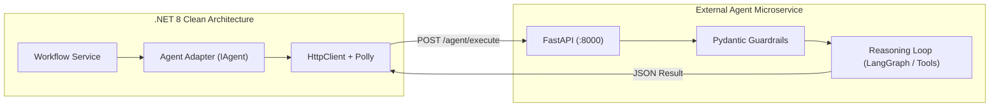

# Python Agent Documentation Update Report

**Report Date:** 2026-09-08  
**Task:** Create External Python Agent Service Architecture Documentation  
**Status:** Completed  
**Impact:** Documentation Only (Zero source code modifications)

---

## 1. Executive Summary

As part of AssistLK's architectural roadmap, this update provides comprehensive architectural guidance for implementing AI agents as external Python microservices while preserving the integrity of the existing .NET 8 Clean Architecture backend.

All changes were executed strictly within the documentation scope:
- **Backend source code:** Unchanged
- **Frontend source code:** Unchanged
- **Database schema & migrations:** Unchanged
- **Component 1 implementation:** Unchanged

---

## 2. Created and Modified Files

| File | Status | Description |
|---|---|---|
| [`docs/architecture/external-python-agent-service.md`](file:///g:/SE3090_A1/AssistLK/docs/architecture/external-python-agent-service.md) | **Created** | Definitive guide covering dual-agent models, folder layouts, contracts, integration flows, safety rules, testing, deployment, and comparison matrices. |
| [`docs/architecture/python-agent-documentation-update-report.md`](file:///g:/SE3090_A1/AssistLK/docs/architecture/python-agent-documentation-update-report.md) | **Created** | Summary report documenting architecture decisions, integration patterns, and verification results. |
| [`docs/README.md`](file:///g:/SE3090_A1/AssistLK/docs/README.md) | **Updated** | Added reference link to the new External Python Agent Service document in the single-source-of-truth index. |

---

## 3. Key Architecture Decisions

### 3.1 Dual-Agent Implementation Model
AssistLK explicitly supports two complementary implementation paradigms:
1. **Native .NET Agent (`backend/src/AssistLK.Agents`):**  
   Optimized for domain-heavy workflows, close entity integration, low latency, and direct dependency injection (e.g., `ProblemUnderstandingAgent`).
2. **External Python Agent Service (`agent-services/<agent-name>`):**  
   Optimized for AI-heavy workflows, complex graph reasoning (LangGraph), ML ecosystems (PyTorch, scikit-learn, spaCy), and decoupled experimentation.

### 3.2 Strict Physical and Logical Boundary Isolation
- Python services are strictly isolated in a top-level `agent-services/` root directory and **never** placed inside `backend/`.
- Every Python service is self-contained with its own dependencies (`requirements.txt`), unit tests, virtual environment, and `Dockerfile`.

### 3.3 Clean Architecture & Entity Ownership Invariants
- **No Direct Database Access:** External Python services are strictly prohibited from connecting to the PostgreSQL database.
- **Single Source of Truth:** Only the .NET `AssistLK.Application` and `AssistLK.Infrastructure` layers maintain read/write authority over domain entities and database tables.
- **Advisory Role:** External agent outputs are treated as untrusted suggestions until validated and mapped to domain models by .NET workflow services.

### 3.4 Safety and Memory Governance
- **No Raw Chain-of-Thought:** Internal intermediate tokens, scratchpads, or conversational traces are never returned to clients or persisted in the database.
- **Contract Enforcement:** All communication relies on strongly-typed JSON request/response schemas with confidence scoring.
- **Human Approval Gates:** High-risk actions automatically trigger `requiresApproval: true`, causing the .NET `AgentSafetyPolicyEngine` to pause execution for human verification.

---

## 4. Integration Approach

The integration between .NET and Python services follows the **Adapter Pattern**:

1. **Abstraction Transparency:** The .NET Application layer invokes `IAgent.ExecuteAsync()`. It does not know or care whether the agent executes in-process (C#) or out-of-process (Python).
2. **Standardized Contract:** Requests pass through `POST /agent/execute` with `workflowId`, `executionId`, `agentName`, and contextual `input`. Responses return `success`, `result`, `confidence`, `requiresApproval`, and error metadata.
3. **Resilience Policies:** The .NET adapter wraps HTTP calls with Polly retry and circuit breaker policies to guarantee platform fault tolerance.
4. **Network Security:** Python microservices operate strictly on internal Docker networks and are never exposed to public internet traffic.

---

## 5. Verification and Validation

- **Git Validation:** Ran `git diff --check` across the repository; completed with 0 errors or whitespace issues.
- **Link Integrity:** Verified internal Markdown file links in `docs/README.md` and `docs/architecture/external-python-agent-service.md`.
- **Constraint Compliance:** Confirmed that zero code files in `backend/`, `web/`, or database migrations were modified.

---

## 6. Core Philosophical Rule

> *"The programming language does not define an agent. An agent is defined by responsibility, reasoning capability, tools, safety controls, and integration contract."*
