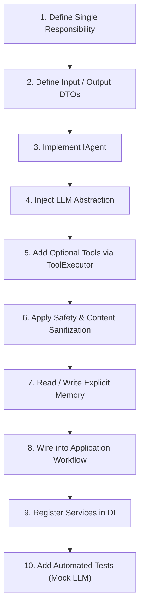

# How to Create a .NET Agent in AssistLK

**Status:** Authoritative Developer Guide  
**Applies To:** All backend engineers creating in-process .NET 8 agents  
**Related Documents:** [Agent Foundation](../architecture/agent-foundation.md), [Component Boundaries](../architecture/component-boundaries.md), [External Python Agent Service](../architecture/external-python-agent-service.md)

---

## 1. Overview & Architectural Boundaries

In AssistLK, native .NET agents execute within the backend process (`AssistLK.Agents`). They provide fast, type-safe AI reasoning powered by Google Gemini and deterministic support tools.

### Allowed Dependencies
An agent implementation **MAY** depend on:
- ✅ `IGeminiService` (or other approved LLM abstraction)
- ✅ `ToolExecutor` (for invoking registered `IAgentTool` instances)
- ✅ Registered tools (`IAgentTool`)
- ✅ `AgentSafetyPolicyEngine` / safety rules
- ✅ `AgentMemoryService` (for reading explicit contextual memory)
- ✅ Strongly typed DTOs and contracts
- ✅ `ILogger<TAgent>`

### Strictly Prohibited Dependencies
An agent implementation **MUST NOT** directly depend on or reference:
- ❌ `AssistLKDbContext` or any Entity Framework `DbContext`
- ❌ EF Core repositories (`IServiceRequestRepository`, etc.) for persistence or mutation
- ❌ ASP.NET Core controllers or action results
- ❌ Raw HTTP request or response objects (`HttpContext`, `HttpRequest`)
- ❌ Direct cross-component internal implementations
- ❌ Raw SQL or database connections (`NpgsqlConnection`, etc.)

> **Persistence Rule:** Domain state changes and database updates are **strictly** the responsibility of the Application workflow service (`AssistLK.Application`), which calls the agent, validates the result, and updates domain entities via repository interfaces.

---

## 2. The 10-Step Agent Development Workflow



### Step 1: Define Agent Responsibility
Each agent must have exactly **one** distinct responsibility.
- Example: *Component 2 Provider Matching Agent* evaluates candidate providers against a categorized service request. It does **not** create bookings or manage provider payouts.

### Step 2: Define Structured Input/Output DTOs
Place input and output models in `backend/src/AssistLK.Agents/Models/`:
```csharp
namespace AssistLK.Agents.Models;

public sealed record SampleAgentInput
{
    public required Guid EntityId { get; init; }
    public required string Criteria { get; init; }
}

public sealed record SampleAgentOutput
{
    public required string AssessmentSummary { get; init; }
    public required decimal Confidence { get; init; }
    public bool NeedsClarification { get; init; }
}
```

### Step 3: Implement `IAgent`
All agents must implement `AssistLK.Agents.Abstractions.IAgent`:
```csharp
namespace AssistLK.Agents.Abstractions;

public interface IAgent
{
    string Name { get; }

    Task<AgentResult> ExecuteAsync(
        AgentContext context,
        CancellationToken cancellationToken = default);
}
```

### Step 4: Inject LLM Abstraction
Inject `IGeminiService` into the agent constructor. Never construct `HttpClient` manually:
```csharp
public class SampleAgent : IAgent
{
    private readonly IGeminiService _geminiService;
    private readonly ToolExecutor _toolExecutor;
    private readonly ILogger<SampleAgent> _logger;

    public SampleAgent(
        IGeminiService geminiService,
        ToolExecutor toolExecutor,
        ILogger<SampleAgent> logger)
    {
        _geminiService = geminiService;
        _toolExecutor = toolExecutor;
        _logger = logger;
    }
}
```

### Step 5: Add Optional Tools
If the agent needs deterministic data enrichment (e.g., location parsing, availability checks), invoke tools via `ToolExecutor`:
```csharp
var toolParams = new Dictionary<string, object>
{
    ["query"] = input.Criteria
};

var toolResult = await _toolExecutor.ExecuteToolAsync(
    "SampleEnrichmentTool",
    toolParams,
    cancellationToken);
```

### Step 6: Apply Safety Validation
Enforce safety policies to sanitize input prompts and validate model outputs:
- Do not output harmful or unsafe instructions.
- Ensure confidence scores fall strictly within `[0.0, 1.0]`.
- Handle LLM failures gracefully using fallback reasoning or degradation.

### Step 7: Use Memory Strictly for Explicit Useful State
Do not dump entire conversation histories or raw blobs into agent memory. Only persist structured, verifiable facts (e.g., `verified_category`, `customer_urgency`).

### Step 8: Integrate Through Application Workflow
Create an application workflow service in `backend/src/AssistLK.Application/Services/`:
- Creates and manages the `AgentWorkflow` state machine.
- Enforces customer ownership checks.
- Sets status to `Analyzing` / `Running`.
- Invokes the agent via `AgentOrchestrator`.
- Validates the resulting DTO.
- Updates the domain entity via the domain repository.
- Sets terminal status (`Completed`, `Failed`, `AwaitingApproval`).

### Step 9: Register Through Dependency Injection
In `backend/src/AssistLK.Api/Program.cs`:
```csharp
// 1. Register agent
builder.Services.AddScoped<SampleAgent>();

// 2. Register in AgentRegistry
builder.Services.AddSingleton<AgentRegistry>(sp =>
{
    var registry = new AgentRegistry();
    registry.Register(sp.GetRequiredService<ProblemUnderstandingAgent>());
    registry.Register(sp.GetRequiredService<SampleAgent>());
    return registry;
});
```

### Step 10: Add Tests
Every agent must be covered by automated tests in `backend/tests/`:
- **Mock the LLM:** Use `FakeGeminiService` or offline simulation. Real network calls to Gemini are strictly prohibited during automated test suites.
- Test normal reasoning flow, tool fallback, edge cases, and safety violations.

---

## 3. Reference Skeleton Template

```csharp
using System.Text.Json;
using AssistLK.Agents.Abstractions;
using AssistLK.Agents.Core;
using AssistLK.Agents.Models;
using Microsoft.Extensions.Logging;

namespace AssistLK.Agents.Agents;

/// <summary>
/// Skeleton agent illustrating Clean Architecture compliance.
/// </summary>
public sealed class SampleSkeletonAgent : IAgent
{
    private readonly ToolExecutor _toolExecutor;
    private readonly IGeminiService _geminiService;
    private readonly ILogger<SampleSkeletonAgent> _logger;

    public string Name => "SampleSkeletonAgent";

    public SampleSkeletonAgent(
        ToolExecutor toolExecutor,
        IGeminiService geminiService,
        ILogger<SampleSkeletonAgent> logger)
    {
        _toolExecutor = toolExecutor ?? throw new ArgumentNullException(nameof(toolExecutor));
        _geminiService = geminiService ?? throw new ArgumentNullException(nameof(geminiService));
        _logger = logger ?? throw new ArgumentNullException(nameof(logger));
    }

    public async Task<AgentResult> ExecuteAsync(
        AgentContext context,
        CancellationToken cancellationToken = default)
    {
        if (context == null) throw new ArgumentNullException(nameof(context));

        _logger.LogInformation("Executing {AgentName} for workflow {WorkflowId}", Name, context.WorkflowId);

        try
        {
            // 1. Extract input from context
            if (!context.Data.TryGetValue(nameof(SampleAgentInput), out var rawInput) ||
                rawInput is not SampleAgentInput input)
            {
                return AgentResult.Fail("Required input SampleAgentInput was not provided in context.");
            }

            // 2. Deterministic tool enrichment (optional)
            // var toolResult = await _toolExecutor.ExecuteToolAsync("SomeTool", params, cancellationToken);

            // 3. Construct prompt & execute LLM reasoning
            var prompt = $"Analyze criteria: {input.Criteria}";
            var responseJson = await _geminiService.GenerateContentAsync(
                prompt,
                systemInstruction: "You are a specialized AssistLK reasoning agent. Respond only with valid JSON.",
                cancellationToken);

            if (string.IsNullOrWhiteSpace(responseJson))
            {
                return AgentResult.Fail("LLM returned an empty response.");
            }

            // 4. Parse and validate output
            var output = JsonSerializer.Deserialize<SampleAgentOutput>(responseJson, new JsonSerializerOptions
            {
                PropertyNameCaseInsensitive = true
            });

            if (output == null || output.Confidence < 0m || output.Confidence > 1m)
            {
                return AgentResult.Fail("Agent output failed validation rules.");
            }

            // 5. Return success with structured payload
            return AgentResult.Ok("Agent reasoning completed successfully.", output);
        }
        catch (Exception ex)
        {
            _logger.LogError(ex, "Error executing {AgentName}", Name);
            return AgentResult.Fail($"Execution failed: {ex.Message}");
        }
    }
}
```
