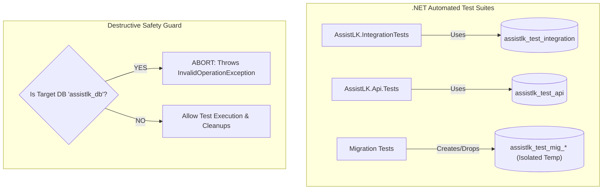

# AssistLK Testing & Quality Assurance Guide

**Status:** Authoritative Engineering Standard  
**Applies To:** All developers contributing code to AssistLK  
**Related Documents:** [Component Development Rules](component-development-rules.md), [Git Workflow](git-workflow.md)

---

## 1. Quality Gate Philosophy

To ensure reliable, multi-developer collaboration across .NET, React, Flutter, and Python agents, all PRs must satisfy the following non-negotiable rules:

1. **No Live External AI Dependencies in Tests:** Automated test suites must **never** make live HTTP calls to Google Gemini or external LLM providers. Use test fakes (`FakeProblemUnderstandingClient`) or deterministic offline simulation.
2. **Real PostgreSQL Database Isolation for Backend:** Backend integration and API tests run against real PostgreSQL test instances (`assistlk_test_integration` and `assistlk_test_api`). EF InMemory database provider is **not** the integration standard.
3. **Destructive Guard Protection:** Tests must **never** perform destructive drops or schema resets against the primary application database (`assistlk_db`).
4. **All Tests Green Before PR:** Backend, Web, and Mobile test suites must pass cleanly without warnings or errors.

---

## 2. Backend Testing Strategy (.NET 8)

The backend test suite is split into two specialized test projects:
- `backend/tests/AssistLK.Api.Tests`: HTTP API, controller endpoints, JWT authentication, and security policies.
- `backend/tests/AssistLK.IntegrationTests`: Application services, workflow state machines, PostgreSQL persistence, and agent reasoning.

### 2.1 Database Test Strategy & Isolation



- **Connection String Resolution:** Tests resolve their PostgreSQL connection via `ASSISTLK_TEST_POSTGRESQL_CONNECTION`, `ConnectionStrings__TestConnection`, or local .NET User Secrets.
- **Transactional / Clean Isolation:** Each test fixture initializes and resets tables within the dedicated test database without affecting developer data.

### 2.2 Agent client isolation

Normal .NET tests use `FakeProblemUnderstandingClient` instead of a running Python service. Adapter and workflow tests verify structured outputs, error handling, clarification, and recovery. They do not call live model providers. PostgreSQL fixtures still require their isolated test databases and credentials.

### 2.3 Running Backend Tests
```bash
# Build solution
dotnet build backend/AssistLK.sln --no-incremental

# Execute full test suite
dotnet test backend/AssistLK.sln
```

---

## 3. Web Frontend Testing (React + Vite + Vitest)

Web tests reside in `web/src/**/__tests__/` and utilize **Vitest** with **React Testing Library**.

### 3.1 What to Test
- **Components:** Render states, user interaction (button clicks, input entry), validation errors.
- **Pages:** End-to-end user workflows, lifecycle actions (e.g. creating a request, opening cancel dialogs, status updates).
- **Services:** Mocking `apiClient` to verify outgoing payloads and error propagation.
- **Auth Guard:** Verifying `ProtectedRoute` denies unauthorized roles and redirects unauthenticated users.

### 3.2 Mocking API Calls
Always mock `apiClient` rather than constructing network requests:
```javascript
import { vi } from 'vitest';
import apiClient from '@/shared/api/apiClient';

vi.mock('@/shared/api/apiClient', () => ({
  default: {
    get: vi.fn(),
    post: vi.fn(),
    put: vi.fn(),
    delete: vi.fn(),
  },
}));
```

### 3.3 Running Web Tests & Linter
```bash
cd web

# Run test suite
npm test

# Run ESLint validation
npm run lint

# Validate production build
npm run build
```

---

## 4. Mobile Testing (Flutter)

Mobile tests reside in `mobile/test/` using standard Flutter test runners.

### 4.1 What to Test
- **Model Serialization:** Verify `fromJson` and `toJson` round-trips for API responses.
- **Services:** Mocking HTTP clients (`DioAdapter`) to test authentication and error handling.
- **Widget Tests:** Verify screen elements render and respond to taps without crashing.

### 4.2 Running Mobile Tests
```bash
cd mobile

flutter analyze
flutter test
```

---

## 5. Python agent tests and live smoke verification

From the repository root, with the service venv activated:

```powershell
cd agent-services/problem-understanding-agent
python -m pytest
```

Tests cover schemas, tools, providers, graph, guardrails, and FastAPI using controlled/offline dependencies. See the [service guide](../../agent-services/problem-understanding-agent/README.md#tests).

### Opt-in live integration

The .NET `LocalhostPythonSmokeIntegrationTests` live path requires `RUN_PYTHON_AGENT_SMOKE_TESTS=true` and a running Python service. It is separate from normal isolated testing. The test returns early when not opted in or when the service is unavailable; a green result alone is not proof of live execution. Capture actual request/result evidence and the active provider when deliberately verifying integration. Offline-provider execution also does not prove live model inference.

No current passing totals are hardcoded here; report actual results for each verification run.

---

## 6. Pull Request Testing Checklist

Before opening any Pull Request into `develop`, the developer must verify:

- [ ] All new code has corresponding unit/integration tests.
- [ ] No tests depend on a live external Gemini API key.
- [ ] PostgreSQL test databases (`assistlk_test_integration`, `assistlk_test_api`) pass all migrations and tests cleanly.
- [ ] No hardcoded passwords, tokens, or `.env` files are included.
- [ ] `dotnet test backend/AssistLK.sln` passes with 0 failures.
- [ ] `npm test && npm run lint && npm run build` passes with 0 errors.
- [ ] `flutter test` passes with 0 errors (if mobile code is touched).
